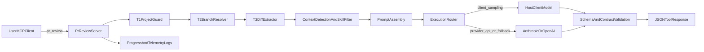

# Architecture and Extendability

## System overview

## End-to-end flow

1. `T1` project guard validates git repo + configured project.
2. `T2` branch resolver validates explicit head branch.
3. `T3` diff extractor computes merge-base diff context.
4. Orchestrator detects stack/patterns and filters skill set.
5. Prompt assembler composes trusted instructions + untrusted payload.
6. Execution router selects `client_sampling`, `provider_api`, or fallback path.
7. Validator enforces schema + track coverage + verdict consistency.
8. Tool returns machine-readable JSON result.

## Review contract enforcement

The server does not trust raw model output. It enforces:

- strict report schema (`ReviewReportSchema`)
- track/heading/subpoint coverage contract generated from active tracks
- verdict mapping consistency

If output is invalid:

- server retries with correction prompt (bounded by configured retries)
- then returns structured error JSON

This is why `pr_review` remains deterministic even with non-deterministic model generation.

## Token efficiency strategy

Token cost control is done structurally, not by dropping review signal:

- one shared changed-files payload for all tracks
- compact per-track prompts (remove repeated boilerplate)
- avoid duplicate full-file payload for added files when unnecessary
- prompt size telemetry emitted in logs
- retries only on invalid/retryable outcomes

## Prompt-injection hardening

The review payload is split into trusted and untrusted regions:

- untrusted diff/file data wrapped with sentinels
- sentinel collision escaping prevents boundary breakouts
- explicit prompt preamble instructs model to ignore instructions from untrusted regions
- path sanitization removes control characters
- trusted `reviewInstructions` channel remains separate from diff content

## Execution router and model paths

Runtime modes:

- `client_sampling`: ask MCP host to execute against host-selected model context
- `provider_api`: execute directly against Anthropic/OpenAI
- `auto`: sampling first, provider fallback if sampling unsupported

This keeps cross-client compatibility while still enabling host-context model use when available.

## Key components

- `src/index.ts`: tool registration + orchestration
- `src/tools/t1-project-guard.ts`: repo/config guard
- `src/tools/t2-branch-resolver.ts`: branch validation
- `src/tools/t3-diff-extractor.ts`: diff context extraction
- `src/orchestrator/detect.ts`: stack/pattern detection and skill filtering
- `src/prompt/assemble.ts`: prompt assembly and contract extraction
- `src/review/execute-review.ts`: execution routing, retry, validation
- `src/review-contract/schema.ts`: report schema contract

## Extendability guide

### Add a new skill

1. Add `src/skills/<your-skill>/index.ts`.
2. Export `metadata` and `buildPrompt`.
3. Register in `src/skills/registry.ts`.
4. Keep heading/checklist format parseable (`### A. ...`, numbered checks).

### Add new detection signals

- Extend framework/pattern/language rules in `src/orchestrator/detect.ts`.

### Add provider execution support

- Add provider implementation in `src/llm/providers/`.
- Wire provider selection in provider factory.
- Keep output validation unchanged.

### Add enrichment sources

- Add adapter in `src/enrichment/`.
- Treat external metadata as untrusted unless explicitly trusted by design.

### Change output schema

1. Update `src/review-contract/schema.ts`.
2. Update validation and result typing in review execution.
3. Update prompt contract instructions.
4. Update tests covering schema/contract enforcement.

## Design rationale

The project deliberately combines deterministic preprocessing with bounded model execution:

- Deterministic phases make behavior observable, testable, and debuggable.
- Model phase is constrained by contracts and retries.
- Final output is always machine-readable JSON suitable for tooling integrations.
- Logging at each stage makes long-running review calls transparent to users.

